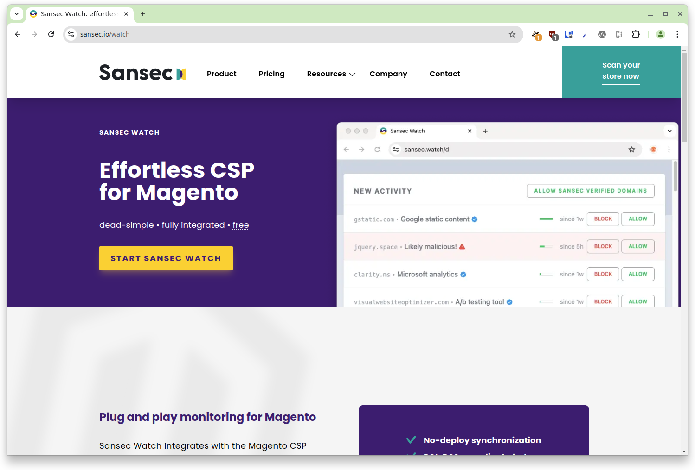
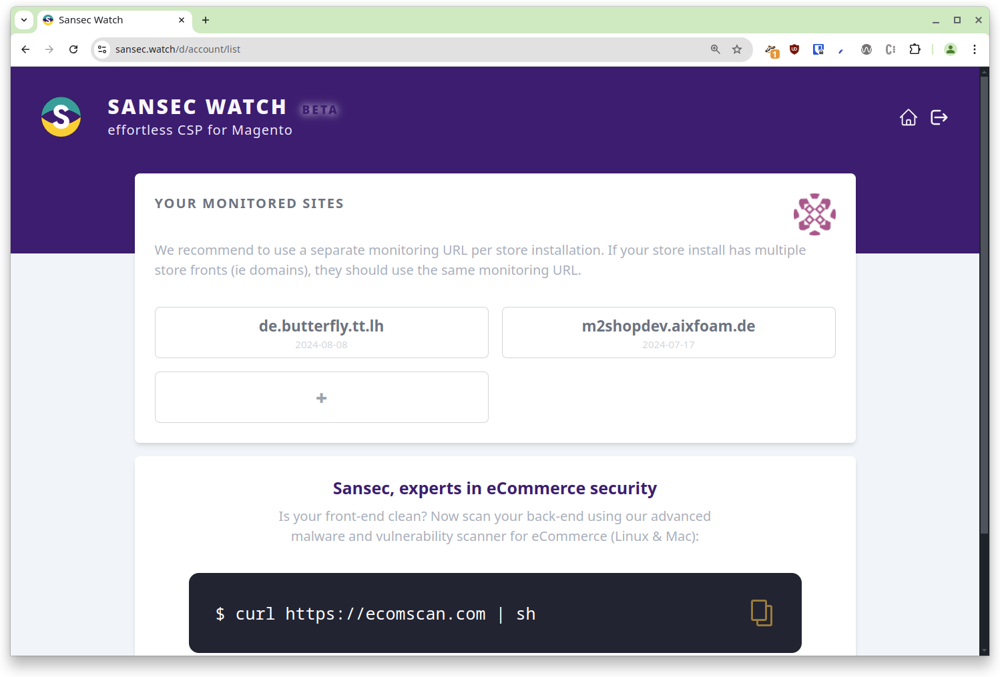
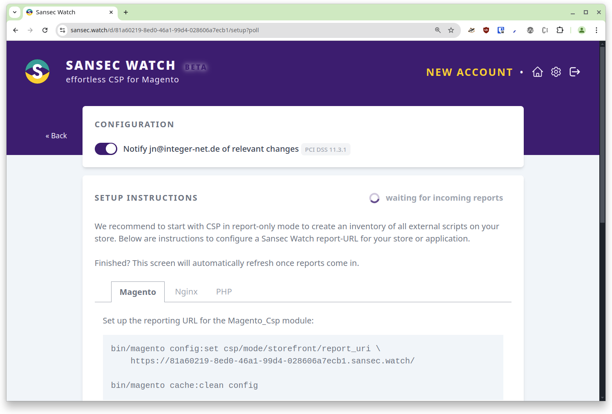
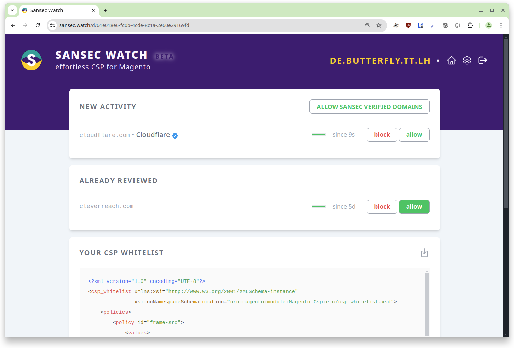
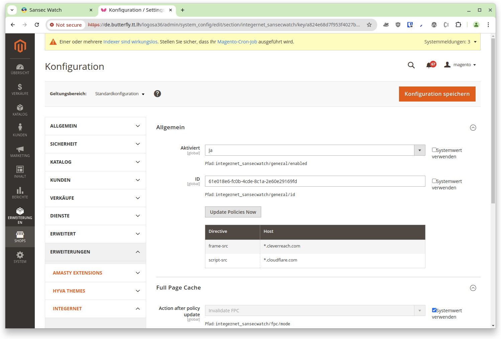

# Documentation

## How to set up

### 1. Create an account on sansec.io/watch

Visit https://sansec.io/watch and click on Start Sansec Watch

### 2. Create a new project in Sansec Watch

After the login, you should be on the page https://sansec.watch/d/account/list
In the top section "your monitored sites", click on the "+" button

### 3. Set the project url as CSP report url in Magento 2

Copy the provided command and execute it on the magento 2 instance to set the CSP report url.

Next visit any page on the magento 2 instance, where an external script is loaded.
Once at least one report is sent to Sansec Watch, the project page should no look like this:

Copy the project ID from the URL (the part after https://sansec.watch/d/, in the case of the screenshot: `61e018e6-fc0b-4cde-8c1a-2e60e29169fd`)

### 4. Configure the sansec project

Go into your Magento 2 backend and navigate to `Shops > Configuration > Integernet > Sansec Watch`.
(In case the RedChamps admin cleanup module is installed: `Shops > Configuration > Extensions > Integernet > Sansec Watch`)

Set `Enabled` to `yes`, paste the previously copied project id into the `ID` config field and save the configuration.

### Allowing or blocking new entries / policies

Once a new report is sent to Sansec Watch, you can see it on the project page

Now you have to decide to either allow or block this domain.
You either have to block or allow this new domain.
Head back into the Magento 2 backend onto the modules configuration page and click on "Update Policies Now".
This will trigger an update in the background and once it's done, the page will reload and show the updated policies int he table below the button.

